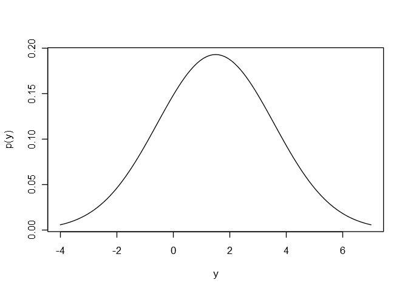
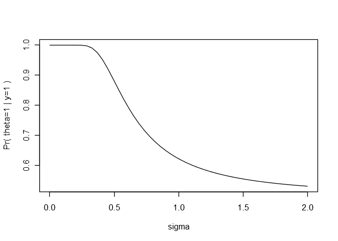
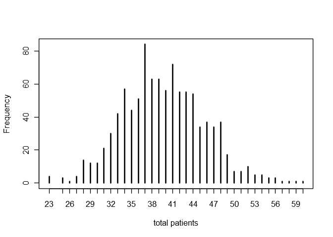
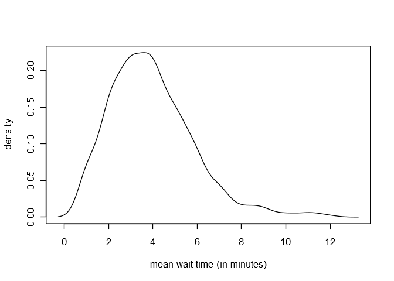

Selected Exercises from Chapter 1
================

There wasn’t really an opportunity to use brms in these exercises, but I
figured I’d post them anyway.

A helper function for plots:

``` r
# From the 'rethinking' package.
# https://github.com/rmcelreath/rethinking
simplehist <- function (x, round = TRUE, ylab = "Frequency", ...) 
{
    if (round == TRUE) 
        x <- round(x)
    plot(table(x), ylab = ylab, ...)
}
```

## 1.1

### (a)

``` r
p <- function(y, sigma) 0.5*dnorm(y, 1, sigma) + 0.5*dnorm(y, 2, sigma)
curve(p(x, 2), from = -4, to = 7, xlab = "y", ylab = "p(y)")
```

<!-- -->

### (b)

``` r
prior <- c(0.5, 0.5)  # Pr(theta = 1) = Pr(theta = 2) = 0.5
likelihood <- c(dnorm(1, 1, 2), dnorm(1, 2, 2))  # Normal(y | theta, sigma)
posterior <- likelihood*prior
posterior <- posterior/sum(posterior)
posterior[1]
```

    ## [1] 0.5312094

### (c)

``` r
sigma.seq <- seq(from = 0.001, to = 2, length.out = 50)
prior <- c(0.5, 0.5)
post <- sapply(
    sigma.seq,
    function(s) {
        likelihood <- c(dnorm(1, 1, s), dnorm(1, 2, s))
        posterior <- likelihood*prior
        posterior/sum(posterior)
    }
)

plot(sigma.seq, post[1,], type = "l", xlab = "sigma", ylab = "Pr( theta=1 | y=1 )")
```

<!-- -->

## 1.6

``` r
# c(fraternal, identical)
prior <- c(1/2, 1)  # probability that sibling was a boy
likelihood <- c(1/125, 1/300)
posterior <- prior*likelihood
posterior/sum(posterior)
```

    ## [1] 0.5454545 0.4545455

Elvis was an identical twin with probability 0.4545… = 5/11.

## 1.7

``` r
# c(prize in selected box, prize in one of other boxes)
prior <- c(1, 2)
likelihood <- c(1, 1)  # Monty opens smaller prize
posterior <- prior*likelihood
posterior/sum(posterior)
```

    ## [1] 0.3333333 0.6666667

## 1.9

We’ll update the simulation minute-by-minute.

### (a)

``` r
###
# code for queue written by George Locke
# https://www.researchgate.net/post/What_is_the_queue_data_structure_in_R
###

# construct queue
new.queue <- function() {
    ret <- new.env()
    ret$front <- new.env()
    ret$front$q <- NULL
    ret$front$prev <- NULL
    ret$last <- ret$front
    return(ret)
}

# add to end of queue
enqueue <- function(queue, add){
    queue$last$q <- new.env()
    queue$last$q$prev <- queue$last
    queue$last <- queue$last$q
    queue$last$val <- add
    queue$last$q <- NULL
}

# return front of queue and remove it
dequeue <- function(queue){
    if (is.empty(queue))
        stop("Attempting to take element from empty queue")
    
    value <- queue$front$q$val
    queue$front <- queue$front$q
    queue$front$q$prev <- NULL
    return(value)
}

# check if queue is empty
is.empty <- function(queue)
    return(is.null(queue$front$q))

sim <- function() {
    doc1 <- data.frame(
        has_patient = 0,
        patient_finished_at = 0
    )
    
    doc2 <- data.frame(
        has_patient = 0,
        patient_finished_at = 0
    )
    
    doc3 <- data.frame(
        has_patient = 0,
        patient_finished_at = 0
    )
    
    patients <- 0
    waited <- 0
    q <- new.queue()
    waits <- numeric()
    
    # time loop
    minute <- 0
    while(minute < 7*60 | doc1$has_patient > 0 | doc2$has_patient > 0 | doc3$has_patient > 0) {
        # any patients leaving?
        if(doc1$has_patient == 1 & doc1$patient_finished_at == minute)
            doc1$has_patient <- 0
        if(doc2$has_patient == 1 & doc2$patient_finished_at == minute)
            doc2$has_patient <- 0
        if(doc3$has_patient == 1 & doc3$patient_finished_at == minute)
            doc3$has_patient <- 0
        
        # anyone in the queue?
        if(!is.empty(q)) {
            # is there a free doctor?
            if(doc1$has_patient == 0) {
                arrived <- dequeue(q)
                waits <- c(waits, minute - arrived)
                
                doc1$has_patient <- 1
                doc1$patient_finished_at <- minute + sample(5:20, 1)
            } else if(doc2$has_patient == 0) {
                arrived <- dequeue(q)
                waits <- c(waits, minute - arrived)
                
                doc2$has_patient <- 1
                doc2$patient_finished_at <- minute + sample(5:20, 1)
            } else if(doc3$has_patient == 0) {
                arrived <- dequeue(q)
                waits <- c(waits, minute - arrived)
                
                doc3$has_patient <- 1
                doc3$patient_finished_at <- minute + sample(5:20, 1)
            }
        }
        
        if(minute < 7*60 & rpois(1, 0.1) > 0) {
            # new patient arrived!
            patients <- patients + 1
            
            # is there a free doctor?
            if(doc1$has_patient == 0) {
                doc1$has_patient <- 1
                doc1$patient_finished_at <- minute + sample(5:20, 1)
            } else if(doc2$has_patient == 0) {
                doc2$has_patient <- 1
                doc2$patient_finished_at <- minute + sample(5:20, 1)
            } else if(doc3$has_patient == 0) {
                doc3$has_patient <- 1
                doc3$patient_finished_at <- minute + sample(5:20, 1)
            } else {
                # all doctors are busy! time to wait.
                enqueue(q, minute)
                waited <- waited + 1
            }
        }
        
        minute <- minute + 1
    }
    
    return(
        list(
            patients = patients,
            waited = waited,
            meanwait = ifelse(waited > 0, mean(waits), 0),
            close = minute
        )
    )
}

sim()
```

    ## $patients
    ## [1] 46
    ## 
    ## $waited
    ## [1] 5
    ## 
    ## $meanwait
    ## [1] 4.6
    ## 
    ## $close
    ## [1] 432

### (b)

Running the simulation 1000 times:

``` r
sims <- 1000
patients <- numeric()
waited <- numeric()
meanwaits <- numeric()
close <- numeric()
for(i in 1:sims){
    s <- sim()
    patients <- c(patients, s$patients)
    waited <- c(waited, s$waited)
    meanwaits <- c(meanwaits, ifelse(s$meanwait > 0, s$meanwait, NA))
    close <- c(close, s$close)
}
meanwaits <- na.omit(meanwaits)

simplehist(patients, xlab = "total patients")
```

<!-- -->

``` r
simplehist(waited, xlab = "number of patients who waited")
```

<!-- -->

``` r
plot(density(meanwaits), xlab = "mean wait time (in minutes)", ylab = "density", main = "")
```

<!-- -->

``` r
simplehist(close, xlab = "minutes office was open")
```

<!-- -->

``` r
data.frame(
    median = c(median(patients), median(waited), round(median(meanwaits), 2), median(close)),
    middle50percent = c(
        paste(quantile(patients, probs = 0.25), "-", quantile(patients, probs = 0.75)),
        paste(quantile(waited, probs = 0.25), "-", quantile(waited, probs = 0.75)),
        paste(round(quantile(meanwaits, probs = 0.25), 2), "-", round(quantile(meanwaits, probs = 0.75), 2)),
        paste(quantile(close, probs = 0.25), "-", quantile(close, probs = 0.75))
    ),
    row.names = c("total patients", "number who waited", "mean wait time", "minutes office was open")
)
```

    ##                         median middle50percent
    ## total patients           39.00         36 - 44
    ## number who waited         3.00           1 - 6
    ## mean wait time            3.71        2.55 - 5
    ## minutes office was open 426.00       420 - 432

-----

[Antonio R. Vargas](https://github.com/szego)

05 Nov 2018
